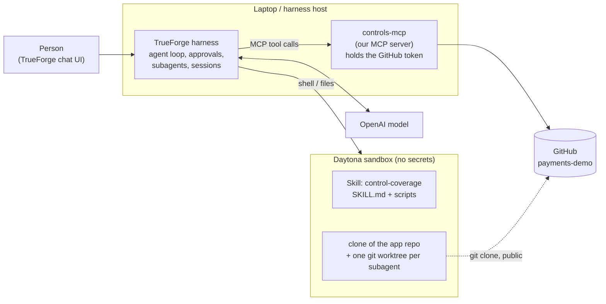
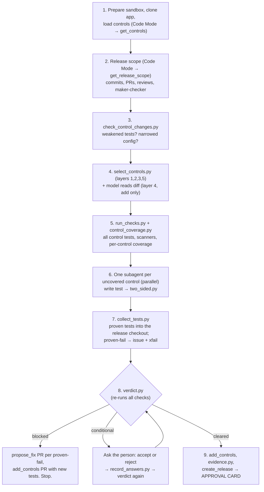

# How Control Coverage works

This document explains, step by step, what Control Coverage is, how each part works, which TrueForge
features it uses and why. It assumes you know Python, git, HTTP APIs and basic testing, but nothing about
banking compliance or agent frameworks.

---

## 1. What it is, in one paragraph

Banks write security rules in plain English, for example *"card numbers must never be stored in plain text"*
or *"admin login must use an authenticator app, not an emailed code"*. Before a release ships, someone has to
confirm the code follows them. Scanners can't do this: they match text patterns, but they can't run the
refund feature and look at what ended up in the database. **Control Coverage is an agent that turns each
written rule into a pytest test, runs it against the release, proves the test is meaningful, measures
whether the release's changed lines are actually executed by those tests, and holds the release until a
person approves it.** It is "code coverage, but for security controls".

---

## 2. The pieces



| Piece | What it is | Where it runs |
|---|---|---|
| **TrueForge** | Open-source agent harness. Runs the model loop, executes tool calls, pauses for approvals and questions, starts subagents, stores every step of a session. | Local process on the laptop (`npx @truefoundry/trueforge`), SQLite state in `.trueforge/` |
| **Agent** (`trueforge/agent.json`) | Model + instructions + tools + skill + runtime settings | Registered in TrueForge |
| **Skill** (`skills/control-coverage/`) | `SKILL.md` (the procedure the agent follows), `controls.yaml` (the bank's rules), Python scripts that compute every fact | Cloned from this git repo into the sandbox |
| **Sandbox** | Isolated Linux machine (Daytona) where all code runs: clone, tests, patches, scripts | Daytona cloud; has **no** credentials |
| **controls-mcp** (`controls_mcp/server.py`) | Our MCP server: the only way the agent reaches GitHub. Enforces safety checks in code. | Laptop, `127.0.0.1:8801` |
| **payments-demo** | A small FastAPI payments service, the app being checked | Separate public repo |

**Why two repos:** the agent tags releases, opens PRs and issues on the app repo, and reads diffs between the
app's tags. Keeping the app separate keeps its history clean, and lets the GitHub token be scoped to the app
only, so the agent can't edit its own rules.

---

## 3. Vocabulary

| Term | Meaning | Example |
|---|---|---|
| **Framework rule** | External requirement | PCI-DSS 3.4 "render card numbers unreadable" |
| **Standard** | The bank's internal rule: what must be true | `STD-CRYPTO-02` Card data protection |
| **Control** | One testable safeguard under a standard | `STD-CRYPTO-02.a` No full card number stored |
| **Method** | How a control is checked | `behaviour_test` (agent writes a test), `scanner` (gitleaks, pip-audit), `code_rule`, `outside_evidence` (can't be checked from code) |
| **Control test** | A pytest file under `controls/tests/` named `test_std_<id>_<letter>[_suffix].py` | `test_std_log_01_a_refunds.py` → `STD-LOG-01.a` |
| **Trigger lines** | The changed lines that caused a control to be selected for this release | `app/api/refunds.py` lines 58–62 |
| **Control coverage** | Whether a control's tests actually execute its trigger lines | refund lines not run by the card test → *uncovered* |
| **Two-sided check** | A test only counts if it **fails** on code that breaks the control and **passes** on code that meets it | remove the audit call → test fails ✔ |
| **Known gap** | A control proven to fail, committed as `@pytest.mark.xfail(strict=True)` with an issue link | `STD-DP-01.a` admin list returns emails |
| **Weakened test** | A control test changed in a release whose *previous* version still fails on the new code | someone loosened the assertion to make CI pass |
| **Verdict** | `blocked`, `conditional`, `cleared_with_exceptions` or `cleared`, computed by `verdict.py` | |

Where data lives:
- **Bank-wide** (same for every app): `skills/control-coverage/controls.yaml`, 10 standards and 15 controls, served through `controls-mcp get_controls`.
- **Per app** (in the app repo, versioned with its code): `controls/config/app.yaml` (tier), `paths.yaml`, `data-classification.yaml`, and `controls/tests/`.

---

## 4. A release run, step by step

The person types: *"Check release v1.2.0 of oplatechie/payments-demo. Previous release: v1.1.1. Release head: main."*



| Step | Who does it | What happens |
|---|---|---|
| 1 | Model → sandbox shell, Code Mode | Installs tools, clones the app at the release head. A Code Mode script calls `get_controls` and writes the YAML straight to `/work/controls.yaml`, so the model never retypes it. |
| 2 | Code Mode → `controls-mcp` | `get_release_scope` returns commits, merged PRs and reviews between the two refs. It also computes maker-checker: every merged PR needs an approval from someone who isn't its author. The script saves the raw JSON to files. |
| 3 | Script | Detects weakened control tests and narrowed per-app config (section 5.5). |
| 4 | Script + model | Deterministic selection (layers 1, 2, 3, 5), then the model reads the diff and may **add** standards with a reason (layer 4). |
| 5 | Script | Runs unit tests, **all** control tests, gitleaks, pip-audit and the TLS rule, then one coverage run per control. Produces a status per control: `covered`, `uncovered`, `no_tests`, `failing` or `known_gap`. |
| 6 | Subagents (parallel) | One per `uncovered`/`no_tests` control. Each writes a test in its own worktree, makes a counter patch, and runs `two_sided.py`. |
| 7 | Script + model | `collect_tests.py` copies only tests proven by `two_sided.py`. Proven-fail tests become known gaps; the model files an issue for each. |
| 8 | Script | `verdict.py` re-runs every check, then applies the rules (section 5.6). |
| 8b | Person | For a conditional verdict: accept (with reason and fix-by version) or reject. `record_answers.py` writes the decision with exact finding IDs. |
| 9 | Model → `controls-mcp`, then person | PR with the new tests; `evidence.py` builds the evidence section; `create_release` **pauses for approval**. |

---

## 5. Core logic

### 5.1 Selecting controls for a release (`select_controls.py`, `rules.py`)

Goal: from the release diff, find every standard the change could affect, and record **which lines**
triggered each one. Five layers run every time. The result is their **union**, and no layer can remove what another added.

| Layer | Looks at | Config | Example hit |
|---|---|---|---|
| 1. Paths | Where the changed file is | `controls/config/paths.yaml` | `app/api/payments.py` → STD-CRYPTO-02 |
| 2. Data classification | Changed lines that use a classified field | `controls/config/data-classification.yaml` | a line using `card_last4` (PAN_LAST4) → STD-CRYPTO-02, STD-LOG-01 |
| 3. Code-structure rules | What the changed code does, via Python `ast` (not regex) | central, in `rules.py` | new `@router.get` → STD-AC-01, LOG-01, SDLC-01, DP-01; `send_email` in auth code → STD-AC-02; `log.info(body)` → STD-CRYPTO-02; `httpx.post` → STD-CRYPTO-01 |
| 4. Model reads the diff | Anything the rules can't express | — | "sends statement data to a partner through a wrapper" → STD-DP-01, with a reason |
| 5. App tier | Nothing; always applies | `controls/config/app.yaml` | tier 1 → every critical standard |

Details that matter:
- **Union of old and new config.** Paths and fields are taken from the config at the previous tag *and* at the release. So a release that edits `paths.yaml` to drop a file can't use that edit to escape checks in the same release.
- **Unmatched files.** Any changed app file that no layer linked to a control is listed and becomes an item a person must acknowledge.
- **Not app code** is ignored for triggers: `controls/`, the team's `tests/`, fixtures, docs and CI.
- **Setup mode:** if the app has no `controls/config/`, every standard applies and the whole repo is treated as the diff.

### 5.2 Running the checks (`run_checks.py`)

- **Unit tests** (`tests/`) and **all control tests** (`controls/tests/`), with junit XML output. `xfail` is recognised as a known gap.
  All existing control tests run on every release, whatever changed, so a selection miss can never skip an existing check.
- **Scanners:** gitleaks (downloaded on demand) for secrets, pip-audit for dependency CVEs.
- **Code rule:** no `http://` calls and no `verify=False` (STD-CRYPTO-01.a).
- **One coverage run per control:** `pytest controls/tests/test_std_x_*.py --cov=app` for each control separately.
  *Why not coverage.py's per-test "contexts"?* FastAPI runs sync endpoints in a worker thread pool, and coverage's
  per-test labels don't carry into those threads reliably. We saw lines executed by one test credited to another.
  Separate runs attribute lines correctly.

### 5.3 Control coverage (`control_coverage.py`)

For each selected `behaviour_test` control:
1. Take its trigger lines and keep only **executable** ones (coverage's executed + missing lines), so blank lines, decorators and docstrings drop out.
2. Subtract the lines executed by that control's own coverage run.
3. Status:
   - `no_tests`: none exist
   - `failing`: a test fails
   - `known_gap`: xfail
   - `uncovered`: tests pass but don't run some trigger lines
   - `covered`: tests pass and run every trigger line

Example from the demo: `test_std_crypto_02_a.py` passes, but only calls `/payments`. The new refund code at
`app/api/refunds.py:37–52` is never executed, so the control is **uncovered** even though its test is green.

### 5.4 Writing and proving tests (subagents + `two_sided.py`)

Each uncovered or untested control gets its own subagent (`templates/test_writer.md`):
1. `git worktree add /work/wt/<control>`, so subagents don't collide in the shared sandbox.
2. Write `controls/tests/test_std_<id>_<letter>_<feature>.py` using the app's fixtures (`client`, `merchants`, `db`, `caplog`…).
3. Run it. A setup error means fix the test; a clean assertion failure is a result.
4. Make the **counter patch** in app code: if the test passed, *break* the control; if it failed, *fix* it.
5. Run `two_sided.py`. It runs the test on the release, applies the patch with `git apply`, runs again, reverts, and writes the result file:

| On release code | After patch | Result |
|---|---|---|
| pass | fail (breaking patch) | **proven-pass**: the test can catch a violation |
| fail | pass (fix patch) | **proven-fail**: a real gap, plus a fix shown to work |
| anything else | | **unverified** |

**Only files written by `two_sided.py` count.** In an early run, subagents replied "passed" without running the
check. The fix: `collect_tests.py` and `verdict.py` ignore anything not marked `written_by: two_sided.py`.

### 5.5 Weakened tests and narrowed config (`check_control_changes.py`)

- For each control test **modified or deleted** since the previous tag, run the **previous version** against the new code with `--runxfail`. If it fails, the release changed the test to hide a failure → **weakened** (critical). With `--runxfail`, removing an xfail marker after a genuine fix isn't counted as weakening.
- For config: compare old and new `controls/config`. Removed paths or fields, a lowered tier, dropped `always_apply` entries or new `not_applicable` entries all count as **narrowed** (critical).

### 5.6 Verdict (`verdict.py`)

The model runs this script and reports its output, but can't change it.
1. **Re-runs all checks** first, so it never judges stale results.
2. **Re-derives the selection itself** from the diff (plus the model's add-only list), instead of trusting the model's list.
3. Collects findings: failing controls, known gaps, uncovered trigger lines, unverified controls, scanner hits, weakened tests, narrowed config, maker-checker gaps, unmatched files.
4. Applies the approver's answers (`answers.json`): only **non-critical** findings can be accepted; a rejected finding becomes critical.
5. Rules:

| Condition | Verdict |
|---|---|
| App has no approved setup | blocked |
| Anything incomplete (a selected control with no result, a scanner that didn't run) | blocked |
| Any open critical finding | blocked |
| Any other open finding | conditional |
| All open findings accepted | cleared_with_exceptions |
| Nothing open | cleared |

### 5.7 People's decisions

- **Accept:** the finding is recorded with approver, reason and fix-by version, and appears in the release evidence.
- **Reject:** the release is blocked. For each proven-fail, the agent calls `propose_fix` with the patch that `two_sided.py` showed makes the test pass. This opens a PR that a developer reviews and merges.
- **Publish:** `create_release` is marked destructive, so TrueForge shows an approval card with the tag, SHA, verdict and accepted exceptions.

### 5.8 Setup mode (first run on an app)

The same machinery, with the whole repo as the diff:
1. Ask the tier.
2. Flag vague controls.
3. Draft `controls/config/`.
4. One subagent per behaviour-test control.
5. Proven-fail → issue + xfail.
6. One PR with everything.

The verdict is **blocked until a person merges the setup PR**: the config decides what gets checked, so the
agent can't approve its own scope.

---

## 6. TrueForge features used

| Feature | Where in this project | Why |
|---|---|---|
| **Agent spec via HTTP API** | `scripts/setup.py` registers model provider, sandbox, skill, MCP server and agent from `trueforge/*.json` | Reproducible setup: clone, `.env`, one command |
| **Remote MCP server** | `controls-mcp` on `127.0.0.1:8801` (streamable HTTP) | The agent reaches GitHub only through tools we control |
| **MCP tool annotations → approval policy** | `readOnlyHint` / `destructiveHint` on each tool; the agent uses `require_approval_for_tools: ["@destructive"]` | `create_release` and `change_controls` always pause for a person |
| **Outbound URL guard** | `OUTBOUND_URL_ALLOWED_HOSTS='["127.0.0.1","localhost"]'` in the start script | TrueForge blocks local addresses by default; we open only what's needed |
| **Git-backed skill** | `skills/control-coverage` registered from this GitHub repo | Procedure, rules and scripts versioned together; only the description sits in context until needed |
| **Sandbox as a tool (Daytona)** | All git, pytest, patches and scripts run in the sandbox | Agent-written code can't touch the host; secrets never enter the sandbox |
| **Code Mode** | `get_controls` and `get_release_scope` called from a Python script in the sandbox that writes results to files | Large JSON never passes through the model; no retyping errors |
| **Dynamic subagents** (`create_sub_agent`) | One test-writer per control, started in parallel | Each control is its own write-run-fix loop; the main context gets one line back |
| **Clarifying questions** | Tier in setup; accept/reject for conditional findings | Structured decisions from a person, recorded in the session |
| **Tool approval card** | `create_release`, `change_controls` | The irreversible step waits for a person |
| **Large tool response offloading + compaction** | Enabled in `agent.json` (compaction at 120k tokens) | Long pytest output doesn't fill the context |
| **Sessions** | Every run is stored with each turn, tool call and subagent thread | Demo trace and audit record of what the agent did |
| **Generative UI** | Enabled for the final results table | Readable summary in chat |

---

## 7. Where the agent stops

| Level | Actions | Enforced by |
|---|---|---|
| Allowed without approval | Read GitHub, run anything in the sandbox, open issues, open a PR that **adds new files** under `controls/`, open a **fix PR** that touches **app code only** | `controls-mcp` code: `add_controls` rejects existing paths and anything outside `controls/`; `propose_fix` rejects `controls/`, `tests/`, fixtures and CI |
| A person decides | Accept or reject findings; merge the setup PR; merge fix PRs | Clarifying questions; the agent has no merge tool |
| Approval card | Publish a release; modify or delete existing control files | `destructiveHint` + `require_approval_for_tools` |
| No tool at all | Merge, push to `main`, delete tags or branches, edit CI or branch protection, edit the agent's own rules | Tools not exposed; GitHub token scoped to the app repo |

The symmetry is deliberate: **tests can be added but not weakened, and fixes can change app code but not tests.**
No single agent action can make code and its check agree by editing both.

---

## 8. Scaling to production

| Concern | How the design handles it |
|---|---|
| Hundreds of controls | The model never reads the catalogue. Scripts select the relevant controls and print only their text; `get_controls(standard_ids=…)` fetches a subset. Context size stays flat as the catalogue grows. |
| Large repos and long runs | Subagents keep test output out of the main context; large tool responses are written to files; compaction summarises old turns; Code Mode keeps API data out of the chat. |
| Many apps | Central standards in one skill (pinned git ref); each app's config and tests live in its own repo; the same agent points at any repo. |
| Cost | Subagents start only for controls with no test or uncovered lines. Once committed, tests run in normal CI with no model calls, so each release needs the agent less. TrueFoundry's AI Gateway can add budgets and rate limits without code changes. |
| Integrations | Controls come from a source of record through MCP (`CONTROLS_SOURCE` can be a GRC system's HTTPS export). GitHub access is one MCP server; Jira or ServiceNow tools would be added the same way. |
| Audit | Sessions store every step; release evidence lists controls, test files with git blob hashes, results, accepted exceptions and approvers, plus a re-run command. |

---

## 9. File map

```
control-coverage/
  trueforge/agent.json            agent: model, instructions, MCP servers, skill, runtime config
  trueforge/skills.json           skill registration (this repo, path, ref)
  trueforge/mcp-servers.json      controls-mcp registration
  scripts/start-trueforge.sh      local TrueForge with state in .trueforge/, local-host allowlist
  scripts/start-controls-mcp.sh   starts controls-mcp
  scripts/setup.py                configures TrueForge through its API from .env + trueforge/*.json
  controls_mcp/server.py          the MCP server (GitHub access + code-level checks)
  skills/control-coverage/
    SKILL.md                      procedure the agent follows (setup and release modes)
    controls.yaml                 10 standards, 15 controls (bank-wide)
    templates/test_writer.md      instructions given to each test-writer subagent
    templates/config/*.yaml       formats for per-app config
    scripts/cc_lib.py             shared helpers (git diff parsing, config loading, naming)
    scripts/select_controls.py    selection layers 1,2,3,5 + model additions
    scripts/rules.py              code-structure rules (Python ast)
    scripts/run_checks.py         tests, scanners, code rule, per-control coverage
    scripts/control_coverage.py   per-control coverage status
    scripts/two_sided.py          the fail/pass proof for one test
    scripts/collect_tests.py      brings proven tests into the release checkout
    scripts/check_control_changes.py  weakened tests, narrowed config
    scripts/verdict.py            the verdict
    scripts/record_answers.py     writes the approver's decision
    scripts/evidence.py           release evidence markdown
```

---

## 10. Known limitations

- **Approver identity isn't verified.** TrueForge local mode runs without login. Production would use TrueForge's OIDC login and check that the approver isn't the PR author.
- **The sandbox is agent-controlled.** Results are produced by scripts, but a model could in principle write a fake result file. Mitigations: tests are committed and CI re-runs them. The next step is for `create_release` to require a green CI run on the release SHA.
- **Maker-checker only looks at merged PRs.** Commits pushed directly to `main` aren't flagged yet; branch protection should prevent them.
- **Python/FastAPI only** for behaviour tests and code rules. The layers and scripts are language-neutral in design; the demo isn't.
- **Subagents use the same model** as the main agent. Their output is judged by running code (the two-sided check), not by another model.
